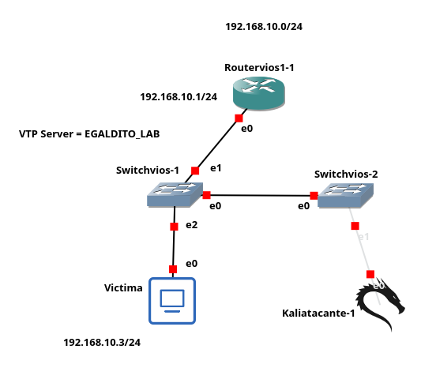

<div align="center">

# 🔀 DTP / VLAN Hopping Attack
### Lab EGALDITO_LAB — Ciberseguridad Ofensiva en Redes


</div>

***

## 📋 Objetivo del Laboratorio

Demostrar cómo un atacante en una red local puede explotar el protocolo **DTP (Dynamic Trunking Protocol)** de Cisco para negociar un enlace trunk con un switch y realizar **VLAN Hopping**, obteniendo acceso a tráfico de VLANs a las que no pertenece.

***

## 🗺️ Topología de Red

<div align="center">


</div>

### Tabla de Direccionamiento

| Dispositivo | Interfaz | Modo | VLAN | IP |
|:---:|:---:|:---:|:---:|:---:|
| R1 | G0/0.10 | Subinterfaz trunk | 10 | `192.168.10.1/24` |
| SW1 | G0/0 | Trunk | All | — |
| SW1 | G0/1 | Trunk | All | — |
| SW2 | G0/0 | Trunk | All | — |
| SW2 | G0/1 | Access | 10 | — |
| Kali Atacante | eth0 / eth0.10 | VLAN tag 802.1Q | 10 | DHCP |

### Imagen topologia


***

## 🎯 Objetivo del Script

El script `DTP_Attack_VLANHOPPING.py` automatiza el ataque DTP/VLAN Hopping:

1. 📡 Captura tramas DTP enviadas por el switch vecino
2. 🤝 Negocia un enlace trunk enviando tramas DTP falsas en modo `Desirable`
3. 🔧 Crea la subinterfaz `eth0.10` con etiquetado 802.1Q
4. 🌐 Obtiene una IP legítima mediante DHCP en la VLAN objetivo

***

## ⚙️ Requisitos

- 🐧 Kali Linux con permisos `root`
- 🐍 Python 3 instalado
- 📦 Scapy: `sudo pip3 install scapy`
- 🔌 Interfaz conectada al switch: `eth0`
- 🔄 Switch con el puerto en modo `dynamic auto` o `dynamic desirable`

***

## 🔧 Parámetros del Script

| Parámetro | Valor por defecto | Descripción |
|:---|:---:|:---|
| `IFACE` | `eth0` | Interfaz física de Kali |
| `SUBIF` | `eth0.10` | Subinterfaz VLAN creada tras el ataque |
| `VLAN` | `10` | ID de la VLAN objetivo |

***

## 📖 Funcionamiento del Script

```
┌─────────────────────────────────────────────────────────────┐
│                    FLUJO DEL ATAQUE DTP                     │
├──────────┬──────────────────────────────────────────────────┤
│ Paso 1   │ Escucha tramas DTP (Multicast 01:00:0c:cc:cc:cc) │
│ Paso 2   │ Envía trama DTP Desirable → negocia trunk        │
│ Paso 3   │ Crea eth0.10 con etiquetado 802.1Q VLAN 10       │
│ Paso 4   │ DHCP Discover→Offer→Request→ACK en eth0.10       │
│ Paso 5   │ IP obtenida → acceso total a VLAN 10             │
└──────────┴──────────────────────────────────────────────────┘
```

### ¿Por qué funciona?

El protocolo DTP en modo `dynamic auto` **acepta** una negociación de trunk si el otro extremo la inicia. Kali se hace pasar por un switch Cisco enviando tramas DTP válidas, y el switch real acepta elevar el puerto a modo trunk, dándole acceso a todo el tráfico etiquetado.

***

## ▶️ Ejecución

```bash
sudo python3 DTP_Attack_VLANHOPPING.py
```

**Salida esperada:**
```
[*] Escuchando tramas DTP...
[+] Trama DTP recibida del switch
[*] Enviando DTP Desirable...
[+] Trunk negociado correctamente
[*] Creando subinterfaz eth0.10 (VLAN 10)...
[+] IP obtenida: 192.168.10.X   GW: 192.168.10.1
```

***

## 🛡️ Contramedidas y Mitigación

> 📄 Ver comandos completos en: [`Mitigacion/SW2.ios`](Mitigacion/SW2.ios)

| # | Medida | Comando | Efecto |
|:---:|:---|:---|:---|
| 1 | Deshabilitar DTP | `switchport nonegotiate` | El switch no acepta ni envía tramas DTP |
| 2 | Forzar modo access | `switchport mode access` | El puerto nunca se convierte en trunk |
| 3 | Cambiar VLAN nativa | `switchport trunk native vlan 999` | Evita VLAN Hopping por VLAN 1 |
| 4 | Apagar puertos vacíos | `shutdown` | Reduce la superficie de ataque |

***

<div align="center">

**EGALDITO_LAB** -  Ciberseguridad Ofensiva en Redes -  2025-0704

</div>
